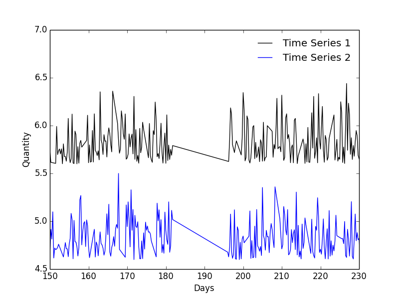
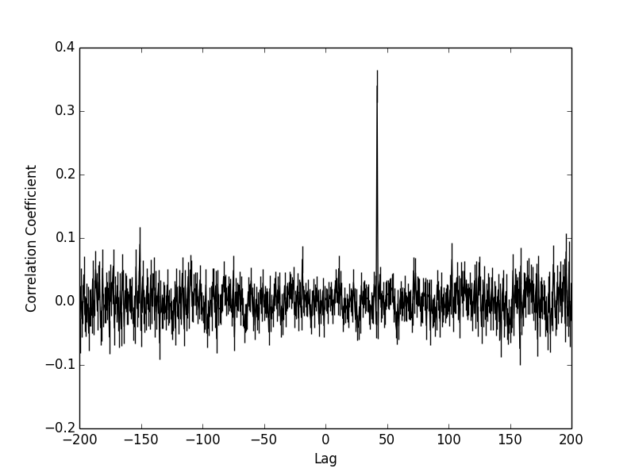

# pyDCF 

A Python cross correlation command line tool for unevenly sampled time series.

## Requirements

* Python 2.7, 3.4, 3.5
* Numpy
* Scipy
* Matplotlib

## Introduction

The Discrete Correlation Function (DCF) was developed by Edelson and Krolik, 1988, ApJ, 333, 646 for use on unevenly sampled and/or gapped data.
Traditional timing analysis, ie: CCF, requires that a time series is sampled evenly in the time domain.
In many real world applications obtaining perfectly sampled data may be difficult [read: dang near impossible], hence the need for a timing analysis tool designed specifically for such cases.

## Installation

`
git clone https://github.com/astronomerdamo/pydcf.git
`

## Usage

For complete usage:

`
python dcf.py -h
`

When calling dcf.py you **must** specify five pieces of information on the commands line:

* path/time_series1.csv : first time series file
* path/time_series2.csv : second time series file
* lag_range_low : low end of the range to be explored
* lag_range_high : high end of the range to be explored
* lag_bin_width : width of lag bin, dt

**Note:** The input time series files must be a Nx2 or Nx3, comma delimited (.csv) file.
That is, N rows with 2 or 3 columns with commas separating the columns, (t y [dy]) - note measurement error is optional in the input file.
Comment lines in the input files must be prefaced with a hastag, #.

The choice of lag range is really up to you, the only thing dcf.py requires is that lag_range_low is less than lag_range_high.
Specify the lag range in the same units as your data, for example if you have a time series which has units of seconds then use seconds for the lag range.

The choice for lag bin width is more subtle.
It's worth mentioning that the DCF doesn't interpolate your data - it interpolates the correlation coefficient according to how you tune the bin width.
However, this does not mean you should choose the finest bin resolution you can.
If resolution is finer than the average resolution of your data the program may break.
Choose a bin width that is too coarse and you may miss important details.

My next ToDo is to implement some kind of automatic bin width choosing algorithm and reporting it to the user.

#### General Guidelines for Choosing Bin Width

* Start with a larger bin size and work down to smaller scales as opposed to small first.
* Never choose a bin width below the average time resolution of your data - I haven't implemented a check for this yet so the onus on you.
* Good starting spot might be ~ 10x average time resolution of your data.
    * For example, if the worst resolution time series if 5 seconds start with 50 second bin width.
    * Larger bin width could also benefit from a Gaussian weighting scheme to help initially explore the data.

### Additional Settings

Optional arguments may be passed to dcf.py:

* -w=[slot, gauss] : corresponds to the weighting of the matching pairs. Default behaviour is 'slot'.
* -p=[0,1,2] : the order of the polynomial to be fit and subtracted from the time series. Default is '0'.
* -np --no-plot : By default dcf.py plots the results in a matplotlib.pyplot window, disable this by including flag.
* -o --output : By default dcf.py does not write any information to file. If you would like a plain text, single comma delimited output file include this flag. Spits out 'dcf_output.csv' in the current working directory.
* -v --verbose : By default dcf.py operates silently, if you are curious or a control freak use this flag.

Obviously, if you choose to run dcf.py and the only optional flag you raise is '--no-plot', the program will start and finish without you, the user, seeing anything at all or knowing that anything had happened.

## Example

Included in this repo is example data, example/ts1.csv and example/ts2.csv. It's supposed to represent realistic data you might encounter.
Let's say, both time series are taken from mysterious power law processes.
You've told one of your grad students to take readings every 6 hours for a year - big mistake.
Not only have they failed taking readings exactly every 6 hours, it seems like they've taken the weekends off and they disappeared for two weeks in the summer leaving a massive gap in your data.
The resulting data is unevenly sampled, has regular short term gaps and a single large long-term gap.

In this case you might be able to interpolate the data to correct for uneven sampling, however, that becomes problematic for the regular weekend gaps and downright negligent for the large two week gap.
This is an example of data where a CCF, interpolated CCF, or even computing a cross spectrum using a FFT or DFT will fail. Luckily the DCF can handle this.

To search for correlation using dcf.py

`
python dcf.py example/ts1.csv example/ts2.csv -100 100 1.5
`

This command attempts to correlate ts1.csv and ts2.csv over a time range of +/- 100 days with a bin width of 1.5 day.
Try it, see that peak at 42 days?
It should be noted that unlike a traditional cross correlation coefficient, which varies from (1,-1) the coefficient found from a DCF may be significant without necessarily having a value of 1 or -1.
There are some tests for significance, an easy implmentation would be a MC approach.

**The reported correlation relates to the first time series. That is, how the first time series should be shifted to match the second, ie: ts2 = ts1 - correlation. Positive correlation is ts1 *leading* ts2, negative correlation is ts1 *lagging* ts2.**

Want more information at every step, maybe there is a linear trend in the data you want to subtract, a different bin weight and you'd like an output file as well:

`
python dcf.py example/ts1.csv example/ts2.csv -100 100 1.5 -v -w=gauss -p=1 -o
`

This spits out a bunch of information (-v for verbose mode), subtracts a linear fit (-p=1 for first order polynomial) from the input data, uses a Gaussian weighting for bin pairs (-w=gauss) and writes 'dcf_output.csv' in the current working directory (-o for output file).

## Reference

Source Paper: [Edelson and Krolik, 1988](http://articles.adsabs.harvard.edu/full/1988ApJ...333..646E)

Published MNRAS: [Robertson, D. et al, 2015](http://arxiv.org/pdf/1507.05201.pdf)
